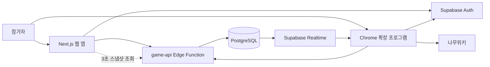
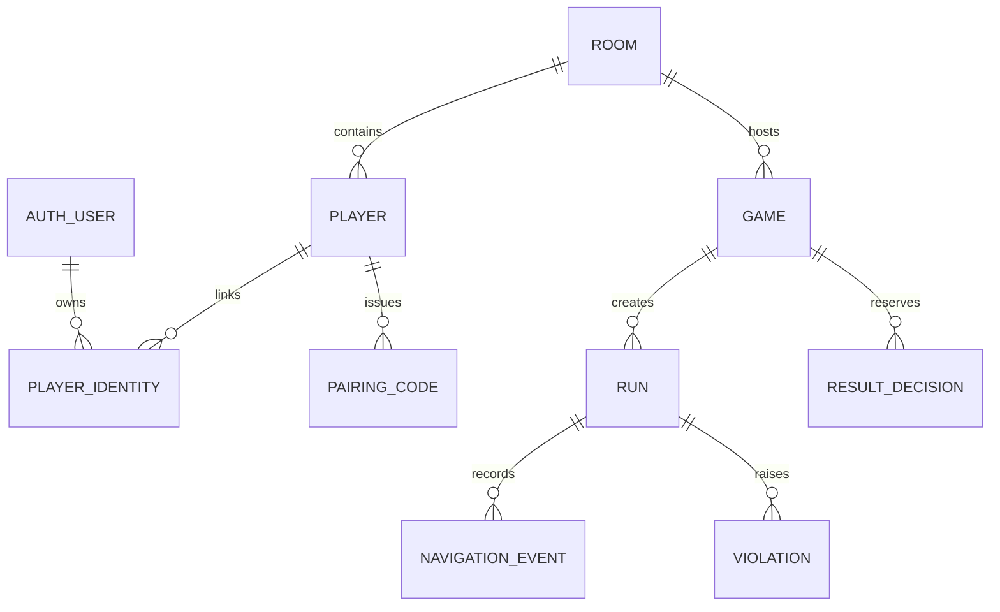
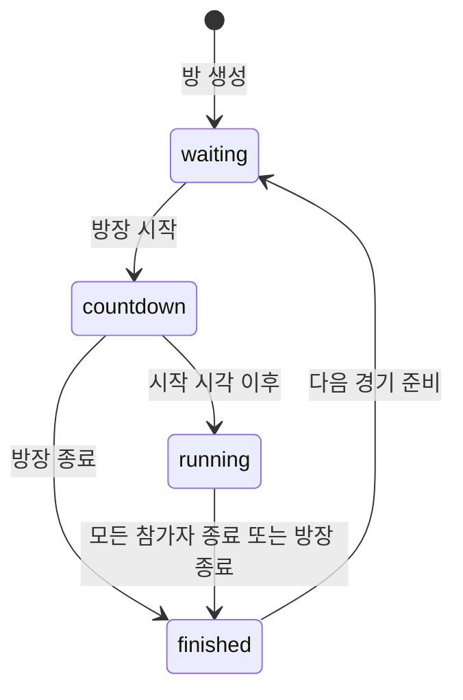
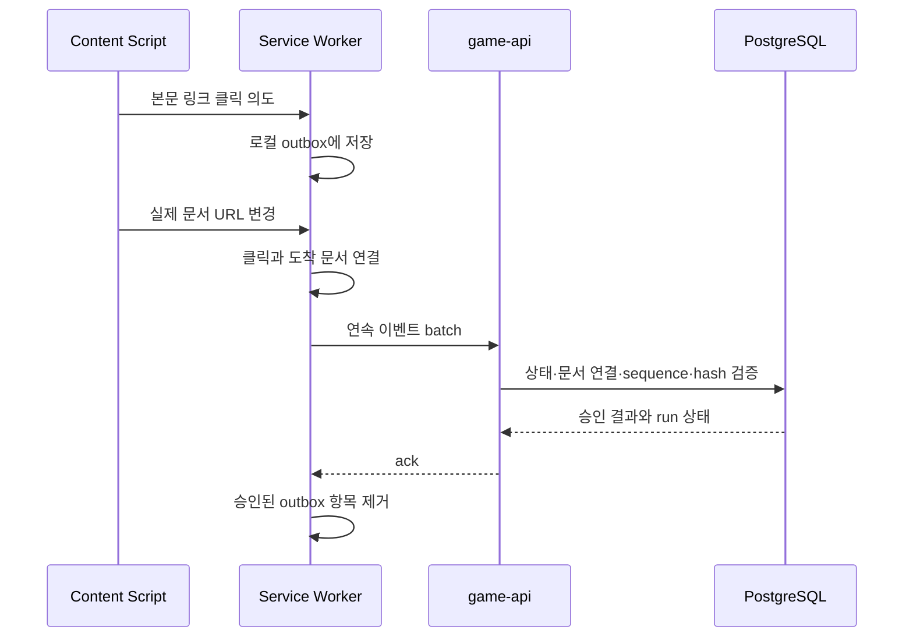

# WikiRunner 아키텍처

이 문서는 저장소에 구현된 현재 구조를 설명한다. 제품 규칙은 [제품 명세](기획서.md),
진행 상태와 수동 점검 항목은 [진행 현황](진행현황.md)을 기준으로 한다.

## 1. 설계 원칙

1. **서버 권위**: 경기 시작 시각, 이벤트 수락, 완주 시각과 순위는 서버가 결정한다.
2. **PostgreSQL이 진실의 원천**: 클라이언트는 재접속할 때 방 스냅샷으로 상태를 복구한다.
3. **클라이언트 불신**: 확장 프로그램의 이벤트와 해시는 검증 자료이며 완전한 부정행위 방지
   수단이 아니다.
4. **명령 경로 단일화**: 상태 변경은 인증된 `game-api` Edge Function을 거쳐 PostgreSQL
   함수에서 원자적으로 처리한다.
5. **재시도 안전성**: 상태 변경과 이동 이벤트는 UUID 멱등키를 사용한다.
6. **최소 수집**: 검색어, 전체 URL·DOM과 브라우징 기록을 저장하지 않는다.

## 2. 실행 구조

| 경로 | 책임 |
| --- | --- |
| `apps/web` | 방 생성·참가, 설정, 준비, 카운트다운, 리더보드와 경로 표시 |
| `apps/extension` | 페어링, 랜덤 경로 생성, 전용 탭·오버레이, 이동 수집, 공정 플레이 차단 |
| `supabase/functions/game-api` | JWT·권한·입력 검증, 명령 라우팅, 스냅샷과 경로 조회 |
| `supabase/migrations` | 테이블, RLS, 상태 전이와 검증용 PostgreSQL 함수 |
| `packages/contracts` | 웹·확장이 공유하는 API 응답 타입과 스키마 버전 |
| `packages/domain` | 상태와 순위 관련 순수 도메인 규칙 |
| `packages/namuwiki` | 나무위키 문서 URL 정규화와 허용 범위 판정 |

웹 대기실은 현재 3초마다 스냅샷을 조회한다. 확장 프로그램은 해당 `rooms` 행의 변경을
Realtime으로 구독하되, 알림을 받으면 다시 스냅샷을 조회한다. Realtime payload 자체를
권위 상태로 사용하지 않는다.

## 3. 인증과 권한

- 웹과 확장 프로그램은 각각 Supabase 익명 사용자로 로그인한다.
- 웹 사용자가 명시적 연결 클릭으로 1분 만료 일회용 nonce를 발급한다.
- 웹 도메인에 주입된 Content Script가 nonce를 Service Worker로 전달하고, 확장 프로그램은 교환 후 같은 플레이어의 `extension` identity가 된다.
- nonce 원문은 저장하지 않고 서버 비밀값으로 만든 해시만 저장한다.
- 방 코드는 검색용 초대 코드일 뿐 인증 수단이 아니다.
- 클라이언트의 테이블 직접 쓰기는 RLS로 막고, 허용된 참가자 범위 읽기만 제공한다.
- 서비스 역할 키와 `PAIRING_CODE_SECRET`는 클라이언트에 제공하지 않는다.

세부 결정은 [ADR-001](adr/ADR-001-anonymous-auth-and-pairing.md)과
[ADR-002](adr/ADR-002-database-authority-and-realtime.md)을 따른다.

## 4. 데이터 모델

| 테이블 | 현재 용도 |
| --- | --- |
| `rooms` | 초대 코드, 방장, 정원, 현재 상태, 다음 경기의 문서 설정과 랜덤 경로 |
| `players` | 방 안의 닉네임, 준비·연결 상태, 확장 연결 시각과 퇴장 상태 |
| `player_identities` | 익명 Auth 사용자와 플레이어의 웹·확장 identity 연결 |
| `pairing_codes` | 만료·시도 횟수·사용 여부가 있는 페어링 코드 해시 |
| `games` | 라운드별 시작·목표·시작 시각·문서 선택 출처의 불변 스냅샷 |
| `runs` | 참가자별 경기 상태, 완주 시간, 이동 수, 순위와 마지막 이벤트 상태 |
| `navigation_events` | 승인된 탐색 이벤트, 연속 번호, 이전/현재 해시와 서버 수신 시각 |
| `violations` | 직접 이동·새 탭 등 실제 탐색이 발생한 공정 플레이 경고 |
| `command_receipts` | 사용자별 멱등키, 요청 digest와 이전 응답 |
| `result_decisions` | 후속 방장 판정 기능을 위해 마련된 스키마. 현재 UI/API에서는 사용하지 않음 |

`rooms`의 문서 설정은 다음 경기 초안이다. 카운트다운 시작 트랜잭션이 이를 새 `games`
행으로 복사하고 참가자별 `runs`를 함께 생성한다. 랜덤 경기라면 확장 프로그램이 제출한
`draft_random_path`도 `games.generated_path`에 복사한다.

### 상태 전이

현재 API 흐름에서 `runs`는 `waiting → running → finished | abandoned`로 전이한다.
스키마에는 후속 판정을 위한 `flagged`, `disqualified` 상태도 정의돼 있지만 아직 판정
UI/API에서는 사용하지 않는다. 경기 중 서버 검증 경고는 `violation_status`로 별도 관리한다.

## 5. 주요 흐름

### 방 생성과 경기 시작

1. 웹이 익명 JWT로 방 생성 또는 참가 명령을 보낸다.
2. 각 플레이어가 확장 프로그램을 페어링하고 준비 상태를 설정한다.
3. 방장은 시작·목표를 직접 저장하거나 랜덤 경로를 생성한다.
4. 카운트다운 명령은 방장, 방 버전, 문서 설정, 참가자 준비와 확장 연결을 검증한다.
5. PostgreSQL 함수가 10초 뒤의 `scheduled_at`, 게임과 참가자별 run을 원자적으로 만든다.
6. 확장 프로그램은 해당 시각에 시작 문서를 전용 게임 탭에서 열고, 등록된 방 탭이 있으면 닫는다.
   완주·포기 확정 뒤에는 경기 탭을 닫고 방 화면을 새 탭으로 연다.

### 랜덤 경로 생성

현재 Supabase Edge Function에서 나무위키 랜덤 문서 요청은 HTTP 403을 받는다. 따라서 실제
사용 흐름에서는 방장 확장 프로그램이 브라우저 네트워크로 제한 깊이 랜덤 워크를 수행한다.

1. `https://namu.wiki/random`의 최종 일반 문서를 시작점으로 삼는다.
2. 현재 문서에서 허용된 내부 링크를 추출하고 방문하지 않은 문서 하나를 고른다.
3. 쉬움 3~4, 보통 5~6, 어려움 7~8단계까지 랜덤 워크를 수행하며, 한 번의 추첨에서 최대 8회 재시도한다.
4. 확장 프로그램이 전체 경로를 `/generated-path`로 제출한다.
5. 서버는 방장 확장 identity, 방 상태·버전, 시작/끝 일치와 10회 추첨 상한을 검증해 저장한다.

`/random-path` 서버 생성 경로도 호환용으로 남아 있지만, 현재 운영 환경에서는 나무위키 응답
제한 때문에 사용 가능한 기본 경로가 아니다. 서버는 제출된 중간 문서 간 실제 링크 존재를
다시 요청해 검증하지 않으므로 방장이 생성 경로를 알 수 있고 조작할 수도 있다.

### 이동 수집과 완주

- `link`만 이동 횟수에 포함한다.
- `back`, `forward`, `reload`는 경로에는 남지만 이동 횟수에는 포함하지 않는다.
- 클릭 의도 없이 문서가 바뀌면 `direct`로 분류하고 경고를 남긴다.
- 서버는 `scheduled_at` 이전 이벤트, sequence 누락, 이전 문서 불일치와 hash chain 불일치를
  거부한다.
- 목표 문서 도달 시 서버 수신 시각을 `finished_at`으로 사용하고
  `duration_ms = finished_at - scheduled_at`으로 계산한다.
- 순위는 `duration_ms`, `move_count`, `finished_at`, run ID 순으로 안정적으로 결정한다.

URL과 시간 결정은 [ADR-003](adr/ADR-003-server-received-finish-time.md)과
[ADR-004](adr/ADR-004-namuwiki-url-normalization.md)에 기록되어 있다.

## 6. 공정 플레이와 확장 권한

확장 프로그램은 나무위키 경기 탭에서 헤더·검색·랜덤 문서·관련 사이드바를 숨기고,
확인된 클릭·단축키와 URL 패턴을 차단한다. 차단된 조작은 화면 안내만 표시하며, 별도 나무위키
탭 이동은 `new_tab`, 직접 탐색은 이동 검증 경고로 서버에 기록한다. 자동 실격은 하지 않는다.

Manifest V3 권한은 다음 용도로 사용한다.

| 권한 | 용도 |
| --- | --- |
| `storage` | 페어링, 활성 경기와 미전송 이벤트 복구 |
| `tabs`, `webNavigation` | 전용 경기 탭 생성과 실제 탐색 관찰 |
| `alarms` | 서비스 워커의 주기적 동기화 |
| `declarativeNetRequest` | 경기 중 검색·랜덤 문서 URL의 세션 차단 |
| 나무위키/Supabase host 권한 | 문서 오버레이, 랜덤 경로 생성과 API 통신 |

이 방식은 주소창, 개발자 도구, 다른 프로필이나 확장 비활성화를 막지 못한다. 자세한 범위는
[ADR-005](adr/ADR-005-warning-based-fairness.md)와
[ADR-006](adr/ADR-006-fair-play-ui-blocking.md)을 따른다.

## 7. API

모든 요청은 익명 사용자 JWT를 요구한다. 상태 변경 요청 본문에는 `schemaVersion: 1`과 UUID
`idempotencyKey`가 포함된다.

| Method / path | 호출자 | 기능 |
| --- | --- | --- |
| `POST /v1/rooms` | 웹 | 방과 방장 생성 |
| `POST /v1/rooms/join` | 웹 | 초대 코드로 참가 |
| `PATCH /v1/rooms/:id/settings` | 웹 | 문서와 정원 설정 |
| `POST /v1/rooms/:id/random-path` | 웹 호환 경로 | 서버 랜덤 경로 생성 시도 |
| `POST /v1/rooms/:id/generated-path` | 방장 확장 | 브라우저에서 만든 랜덤 경로 저장 |
| `POST /v1/players/:id/pairing-code` | 웹 | 일회용 페어링 코드 발급 |
| `POST /v1/players/:id/auto-pairing-nonce` | 웹 | 자동 연결용 1분 nonce 발급 |
| `POST /v1/extension/pair` | 확장 | 페어링 코드 교환 |
| `POST /v1/extension/auto-pair` | 확장 | 자동 연결 nonce 교환 |
| `POST /v1/extension/disconnect` | 확장 | 연결 해제 |
| `PUT /v1/players/:id/ready` | 웹 | 준비 상태 변경 |
| `POST /v1/players/:id/leave` | 웹 | 본인 퇴장 또는 방장의 대기 참가자 강퇴 |
| `POST /v1/rooms/:id/countdown` | 방장 웹 | 게임과 run 생성 |
| `POST /v1/rooms/:id/next-game` | 방장 웹 | 다음 경기 준비 |
| `POST /v1/games/:id/end` | 방장 웹 | 현재 경기 종료 |
| `POST /v1/games/:id/events` | 확장 | 탐색 이벤트 batch 제출 |
| `POST /v1/games/:id/abandon` | 확장 | 참가자 경기 포기 |
| `POST /v1/games/:id/violations` | 확장 | 실제 우회 탐색(예: 새 탭) 경고 보고 |
| `GET /v1/rooms/:id/snapshot` | 웹·확장 | 권한에 맞는 방 전체 상태 조회 |
| `GET /v1/games/:id/routes` | 웹 | 참가자별 승인 경로 조회 |

## 8. 복구와 알려진 한계

| 상황 | 현재 처리 |
| --- | --- |
| 웹 새로고침·Realtime 누락 | 3초 주기 또는 즉시 스냅샷 재조회 |
| 확장 서비스 워커 종료 | `chrome.storage.local` 상태를 읽고 서버 스냅샷과 동기화 |
| 일시적 전송 실패 | outbox에 유지하고 지수 backoff로 재시도 |
| 중복 명령·이벤트 | 멱등키 또는 `client_event_id`로 이전 결과 재사용 |
| sequence 누락 | 서버가 기대 sequence를 반환하고 이후 전송을 보류 |
| 나무위키 DOM 변경 | 현재 선택자가 실패할 수 있어 실제 Chrome 수동 회귀 점검 필요 |

아직 구현되지 않았거나 운영 준비가 필요한 항목은 다음과 같다.

- 웹의 Realtime 기반 즉시 갱신
- 방장의 경고 검토·실격 판정과 `result_decisions` 사용
- 자동 데이터 보존·삭제 작업과 운영 지표·경보
- 브라우저를 조작한 고의적 이벤트 위조 방지

## 9. 배포와 검증

배포 순서는 DB 마이그레이션 → Edge Function → 웹 → 확장 프로그램이다. 로컬 실행과 운영
배포 절차는 루트 [README](../README.md)를 따른다.

현재 자동 검증 범위는 `packages/contracts`, `packages/domain`, `packages/namuwiki`의 단위
테스트와 전체 lint·typecheck·build다. 실제 나무위키 DOM, 확장 권한, 여러 브라우저 참가자와
공정 플레이 차단은 수동 점검이 필요하다.

## 10. 결정 기록

- [ADR-001: 익명 인증과 웹-확장 페어링](adr/ADR-001-anonymous-auth-and-pairing.md)
- [ADR-002: DB 권위 상태와 Realtime 동기화](adr/ADR-002-database-authority-and-realtime.md)
- [ADR-003: 서버 수신 시각 기반 완주 기록](adr/ADR-003-server-received-finish-time.md)
- [ADR-004: 나무위키 URL 정규화](adr/ADR-004-namuwiki-url-normalization.md)
- [ADR-005: 경고 기반 MVP 공정성 모델](adr/ADR-005-warning-based-fairness.md)
- [ADR-006: 공정 플레이 UI 차단](adr/ADR-006-fair-play-ui-blocking.md)
