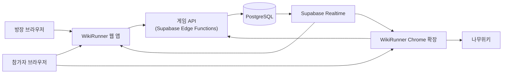
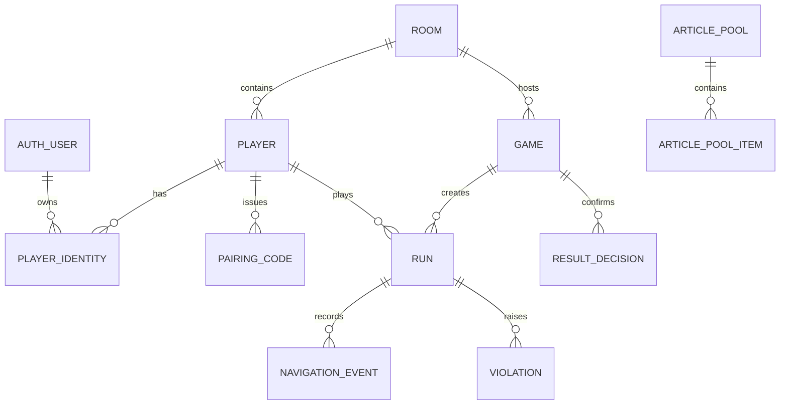
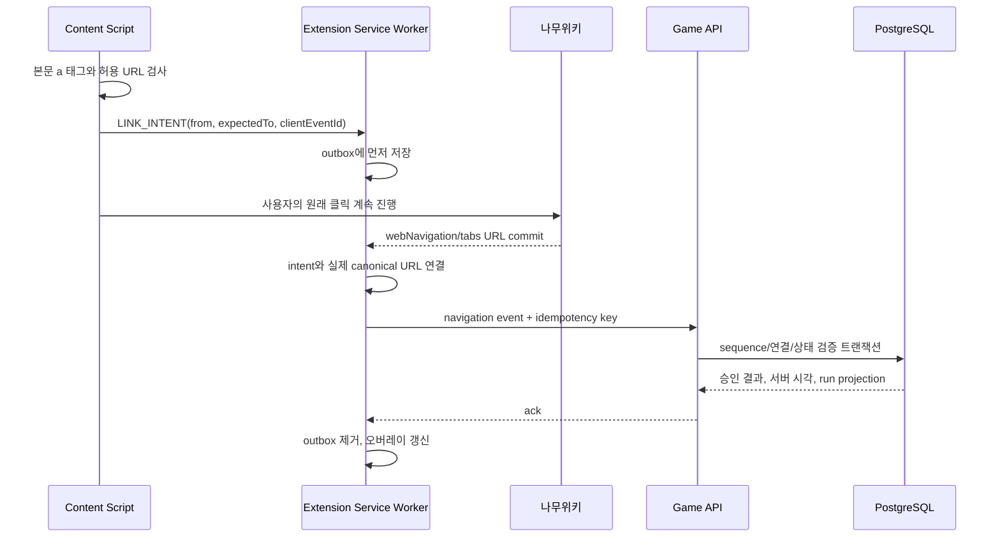
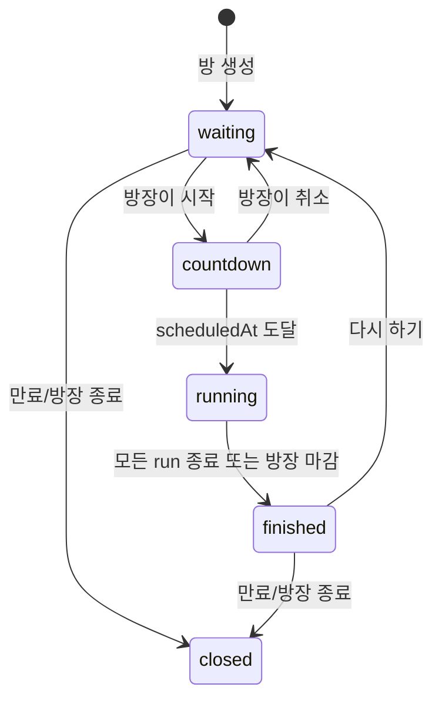
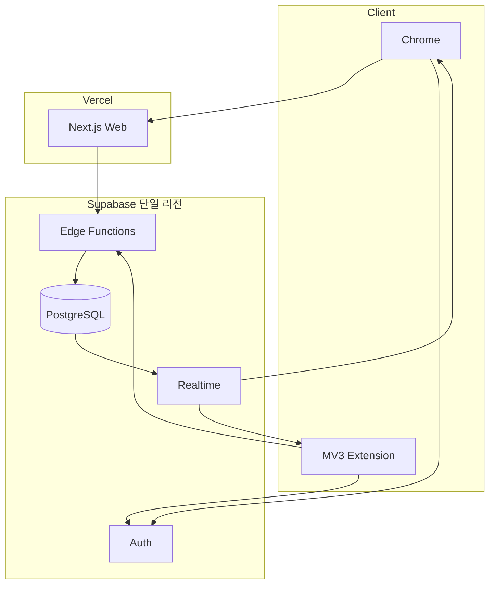

# WikiRunner MVP 아키텍처

- 문서 상태: 제안 확정안
- 기준 기획서: `기획서.md`
- 작성일: 2026-07-27
- 대상 범위: P0 MVP

## 1. 목적과 설계 원칙

WikiRunner는 웹에서 방과 순위를 관리하고 Chrome 확장 프로그램이 나무위키 탐색을 관찰하는 실시간 멀티플레이 게임이다. 이 문서는 기획 요구사항을 구현 가능한 구성요소, 데이터 모델, 인터페이스와 운영 기준으로 구체화한다.

설계 원칙은 다음과 같다.

1. **서버 권위**: 경기 시작 시각, 이벤트 수락 여부, 완주 시각, 순위와 최종 상태는 서버가 결정한다.
2. **클라이언트 불신**: 확장 프로그램 이벤트와 해시 체인은 정상 흐름 검증 자료이지 완전한 부정행위 방지 수단이 아니다.
3. **DB가 진실의 원천**: Realtime 메시지는 빠른 화면 갱신용이다. 재접속 시에는 항상 DB 스냅샷으로 복구한다.
4. **명령과 조회 분리**: 상태 변경은 Edge Function을 통하고, 허용된 조회와 구독만 RLS가 적용된 Supabase API를 사용한다.
5. **최소 권한**: 나무위키 문서와 서비스 웹 도메인에만 확장 프로그램 권한을 부여한다.
6. **재시도 안전성**: 모든 쓰기 명령과 이동 이벤트는 멱등키를 사용한다.
7. **MVP에 맞는 검증**: 명백한 위반을 기록하고 방장에게 근거를 제공하되 자동 실격하지 않는다.

## 2. 기획 결정과 가정

기획서의 미결정 항목은 MVP에서 아래와 같이 적용한다.

| 항목 | MVP 결정 | 설계 영향 |
| --- | --- | --- |
| 문서 선택 | 방장 직접 선택과 운영 문서 풀 랜덤을 모두 지원 | 경기 스냅샷에 선택 출처를 기록 |
| 뒤로가기 | 방문 경로에는 기록하고 이동 횟수에는 미포함 | 이벤트 종류와 `counts_as_move`를 분리 |
| 위반 처리 | 경고만 생성하고 방장이 결과 확정 시 판단 | 원본 기록을 보존하고 판정 이력을 별도 저장 |
| 사용자 인증 | Supabase 익명 인증 | 이메일 등 PII 없이 사용자별 JWT와 RLS 적용 |
| 웹-확장 연결 | 일회용 페어링 코드 사용 | 방 코드만으로 다른 플레이어를 사칭하지 못하게 함 |
| 공식 기록 기준 | 서버가 완주 이벤트를 받은 시각 | 클라이언트 시각은 진단 정보로만 저장 |

나무위키 DOM이나 URL 정책은 서비스가 통제할 수 없으므로 변경 가능성이 높은 외부 계약으로 취급한다. DOM 선택자와 URL 정규화 로직은 확장 프로그램 곳곳에 분산하지 않고 `NamuWikiAdapter` 한 곳에 둔다.

## 3. 시스템 컨텍스트



WikiRunner 서버는 나무위키를 크롤링하거나 탐색 요청을 대행하지 않는다. 사용자가 일반 브라우저로 나무위키를 열고, 확장 프로그램은 브라우저 안에서 URL과 클릭을 관찰한다.

## 4. 컨테이너와 책임

### 4.1 웹 앱

Next.js와 TypeScript로 구현하고 Vercel에 배포한다.

- 홈, 대기실, 경기 현황, 결과 화면
- 익명 로그인과 닉네임 입력
- 방 생성·입장·설정·시작·결과 확정 명령
- 확장 프로그램 페어링 코드 발급
- DB 스냅샷 조회와 Realtime 구독
- `serverNow`와 `scheduledAt`을 이용한 표시용 타이머

웹 앱의 타이머는 사용자 경험을 위한 표시일 뿐 기록 계산에 사용하지 않는다. 참가자마다 정적 렌더 결과에 인증 정보가 섞이지 않도록 인증이 필요한 화면은 동적 렌더링한다.

### 4.2 Chrome 확장 프로그램

Manifest V3와 TypeScript로 구현한다.

| 모듈 | 책임 |
| --- | --- |
| Content Script | 나무위키 문서 판별, 본문 링크 클릭 캡처, canonical URL 읽기, 오버레이 렌더링 |
| Service Worker | 경기 세션, 게임 탭, 탐색 이벤트, 로컬 outbox, 서버 통신과 Realtime 연결 관리 |
| Popup | 방/플레이어 페어링, 연결 상태, 복구와 연결 해제 |
| `NamuWikiAdapter` | 허용 링크 판정, 문서 키 정규화, 본문 영역과 canonical 정보 추출 |
| Event Correlator | 클릭 의도와 실제 URL 전환을 연결하고 이벤트 종류 및 위반 후보 생성 |

MV3 서비스 워커는 유휴 시 종료될 수 있으므로 메모리를 영속 상태로 간주하지 않는다.

- 페어링 세션, 활성 `gameId`, `runId`, `gameTabId`, 마지막 서버 승인 sequence는 `chrome.storage.local`에 저장한다.
- 처리 중인 짧은 상태는 `chrome.storage.session`을 사용할 수 있다.
- 미전송 이벤트는 크기가 작으므로 `chrome.storage.local` outbox에 저장한다.
- 서비스 워커가 다시 시작될 때 저장 상태와 서버 스냅샷을 비교해 복구한다.

### 4.3 게임 API

Supabase Edge Functions에 논리 API를 구현한다. 초기에는 배포와 공통 인증 처리를 단순화하기 위해 하나의 `game-api` 함수 안에 라우터를 두되, 도메인 서비스는 분리한다.

- JWT 검증 및 플레이어/방장 권한 확인
- 방 코드 생성, 인원·닉네임 중복 검사
- 일회용 확장 페어링
- 방 설정과 카운트다운 시작의 트랜잭션 처리
- 이동 이벤트 정규화·검증·저장
- 위반 생성, 완주 처리, 순위 재계산
- 요청별 rate limit과 감사 로그

복수 테이블을 함께 바꾸는 명령은 PostgreSQL 함수(RPC) 한 번으로 실행해 원자성을 보장한다. 서버 비밀키는 Edge Function 밖으로 노출하지 않는다.

### 4.4 PostgreSQL

- 영구 상태의 단일 진실의 원천
- PK, FK, CHECK, UNIQUE 제약으로 도메인 불변식 보장
- RLS로 방 참가자 범위의 읽기만 허용
- 명령용 PostgreSQL 함수에서 행 잠금과 상태 전이 수행
- 상태 변경 후 private Realtime 채널로 안전한 projection만 발행

### 4.5 Realtime

- 채널: `room:{roomId}` 및 `game:{gameId}`
- 방 참가자만 수신 가능한 private 채널
- 클라이언트의 Broadcast 쓰기는 금지하고 서버/DB trigger만 발행
- 대기실 참가자 상태, 경기 상태, 공개 리더보드와 위반 유무만 전송
- 이동 경로 상세는 해당 플레이어와 방장만 별도 조회

Realtime은 전달 보장 큐가 아니다. 구독 연결 직후, 재연결 후, sequence 누락 감지 시 `GET snapshot`을 호출한다.

## 5. 권장 저장소 구조

```text
wikirunner/
├── apps/
│   ├── web/                    # Next.js 웹 앱
│   └── extension/              # MV3 확장 프로그램
├── packages/
│   ├── contracts/              # API DTO, 이벤트, enum, Zod schema
│   ├── domain/                 # 상태 전이와 순위 규칙
│   └── namuwiki/               # URL 정규화 규칙과 공유 테스트 벡터
├── supabase/
│   ├── functions/game-api/
│   ├── migrations/
│   ├── seed.sql                # 로컬 문서 풀과 테스트 데이터
│   └── config.toml
├── tests/
│   ├── e2e/
│   └── fixtures/
└── docs/
    ├── 아키텍처.md
    └── adr/
```

웹과 확장 프로그램이 같은 DTO를 사용하도록 `contracts`를 공유한다. URL 파서는 브라우저 DOM 접근 부분과 순수 정규화 함수를 나눠 서버와 확장에서 동일한 테스트 벡터를 실행한다.

## 6. 핵심 도메인 모델

기획서의 초안에 `Game`을 추가한다. `Room`과 경기를 분리해야 같은 방에서 다시 하기, 라운드별 문서 스냅샷, 과거 결과 보존을 자연스럽게 지원할 수 있다.



### 6.1 테이블

#### `rooms`

| 필드 | 타입/제약 |
| --- | --- |
| `id` | uuid PK |
| `invite_code` | char(6), 활성 방에서 unique |
| `host_player_id` | uuid FK |
| `status` | `waiting`, `countdown`, `running`, `finished`, `closed` |
| `max_players` | smallint, 2..12 |
| `current_game_id` | uuid nullable FK |
| `draft_start_article_key`, `draft_start_article_title` | text nullable |
| `draft_target_article_key`, `draft_target_article_title` | text nullable |
| `draft_article_source` | `host`, `pool`, `random` |
| `created_at`, `expires_at` | timestamptz |
| `version` | bigint, 낙관적 동시성 제어 |

대기실의 문서 선택은 `rooms`의 draft 필드에 저장한다. 카운트다운 트랜잭션이 이를 불변
`games` 스냅샷으로 복사하며, 경기가 생성된 뒤에는 해당 game의 문서와 규칙을 수정하지
않는다.

#### `players`

| 필드 | 타입/제약 |
| --- | --- |
| `id` | uuid PK |
| `room_id` | uuid FK |
| `nickname` | varchar(20), 방 안에서 대소문자 무시 unique |
| `ready_at` | timestamptz nullable |
| `connection_status` | `online`, `offline`, `left` |
| `last_seen_at` | timestamptz |
| `joined_at` | timestamptz |

#### `player_identities`

웹과 확장이 서로 다른 익명 Supabase 사용자여도 같은 플레이어에 연결할 수 있게 한다.

| 필드 | 타입/제약 |
| --- | --- |
| `id` | uuid PK |
| `auth_user_id` | uuid, `auth.users.id` 참조 |
| `player_id` | uuid FK |
| `kind` | `web`, `extension` |
| `created_at`, `revoked_at` | timestamptz |

한 플레이어에는 활성 웹 identity와 확장 identity가 각각 최대 하나만 존재한다. 같은 익명
사용자가 여러 방의 과거 기록을 가질 수 있으므로 `auth_user_id` 하나만 PK로 사용하지 않고,
`(auth_user_id, player_id, kind)`를 unique로 둔다.

#### `pairing_codes`

| 필드 | 타입/제약 |
| --- | --- |
| `id` | uuid PK |
| `player_id` | uuid FK |
| `code_hash` | text, 원문 저장 금지 |
| `expires_at` | timestamptz, 발급 후 5분 |
| `used_at`, `revoked_at` | timestamptz nullable |
| `attempt_count` | smallint |

코드는 일회용이고 성공 또는 5회 실패 시 폐기한다. 방 코드는 방 검색용이며 인증 수단으로 사용하지 않는다.

#### `games`

| 필드 | 타입/제약 |
| --- | --- |
| `id` | uuid PK |
| `room_id` | uuid FK |
| `round_no` | integer, 방 안에서 unique |
| `status` | `countdown`, `running`, `finished`, `cancelled` |
| `start_article_key`, `start_article_title` | text |
| `target_article_key`, `target_article_title` | text |
| `article_source` | `host`, `pool`, `random` |
| `scheduled_at` | timestamptz |
| `started_at`, `finished_at` | timestamptz nullable |
| `rules_version` | integer |
| `created_at` | timestamptz |

문서 제목은 표시용이고 `article_key`는 비교용 정규화 값이다. 경기 생성 후 시작·목표·규칙은 수정하지 않는다.

#### `runs`

| 필드 | 타입/제약 |
| --- | --- |
| `id` | uuid PK |
| `game_id`, `player_id` | uuid FK, 조합 unique |
| `status` | `waiting`, `running`, `finished`, `abandoned`, `flagged`, `disqualified` |
| `started_at`, `finished_at` | timestamptz nullable |
| `duration_ms`, `move_count`, `rank` | bigint/int nullable |
| `last_sequence` | integer, 기본 0 |
| `last_article_key` | text |
| `last_event_hash` | text nullable |
| `violation_status` | `clear`, `warned`, `reviewed` |
| `version` | bigint |

#### `navigation_events`

기획서의 `MoveEvent`를 일반화한다. 뒤로가기와 새로고침도 경로에 남기기 위함이다.

| 필드 | 타입/제약 |
| --- | --- |
| `id` | uuid PK |
| `client_event_id` | uuid, run 안에서 unique 멱등키 |
| `run_id` | uuid FK |
| `sequence` | integer, run 안에서 unique |
| `event_type` | `link`, `back`, `forward`, `reload`, `direct`, `tab_resume` |
| `from_article_key`, `to_article_key` | text |
| `counts_as_move` | boolean |
| `client_observed_at` | timestamptz, 참고용 |
| `server_received_at` | timestamptz, 기록 기준 |
| `navigation_meta` | jsonb, 필요한 최소 진단 정보 |
| `previous_hash`, `event_hash` | text |
| `validation_status` | `accepted`, `accepted_with_warning`, `rejected` |

`counts_as_move=true`는 검증된 본문 내부 링크 이동에만 설정한다. raw URL, 전체 DOM, 검색어는 저장하지 않는다.

#### `violations`

| 필드 | 타입/제약 |
| --- | --- |
| `id` | uuid PK |
| `run_id`, `event_id` | uuid FK |
| `type` | `unmatched_navigation`, `direct_target`, `search_attempt`, `external_link`, `new_tab`, `wrong_tab`, `sequence_gap`, `chain_mismatch`, `invalid_scope` |
| `severity` | `info`, `warning`, `high` |
| `detected_at` | timestamptz |
| `detail` | jsonb, 민감정보 제외 |
| `resolution` | `pending`, `accepted`, `disqualified` |
| `resolved_by`, `resolved_at`, `resolution_note` | nullable |

#### `article_pools`, `article_pool_items`

운영 문서 풀의 이름·활성 여부와 각 문서의 `article_key`, 표시 제목, 난이도 태그, 민감도 검수 상태, 마지막 확인 시각을 저장한다. 게임에는 pool item FK만 의존하지 않고 당시 문서 key와 제목을 함께 복사해, 운영 풀이 바뀌어도 과거 경기를 재현할 수 있게 한다.

#### `result_decisions`

`game_id`, `revision`, `decided_by`, `decided_at`, 전체 순위 projection과 위반별 판정을 저장하는 append-only 테이블이다. `(game_id, revision)`은 unique이며 최종 결과 화면은 가장 높은 revision을 읽는다.

#### `command_receipts`

`idempotency_key`, `auth_user_id`, `command_type`, `request_hash`, `response`, `created_at`을 저장한다. 같은 키와 같은 요청은 이전 결과를 돌려주고, 같은 키에 다른 요청이면 `409`를 반환한다.

### 6.2 핵심 제약

- 시작 문서와 목표 문서는 달라야 한다.
- `scheduled_at` 이후에만 경기 이벤트를 수락한다.
- 한 run의 승인 이벤트 sequence는 1부터 끊김 없이 증가한다.
- 승인된 다음 이벤트의 `from_article_key`는 서버가 기억한 `last_article_key`와 같아야 한다. 뒤로가기처럼 브라우저 이력에 의해 달라질 수 있는 이벤트는 별도 검증 규칙을 적용한다.
- 완주는 승인된 이벤트의 `to_article_key`가 목표와 같을 때 한 번만 처리한다.
- `finished_at`과 `duration_ms`는 클라이언트가 쓸 수 없다.
- 순위는 `duration_ms ASC`, `move_count ASC`, `finished_at ASC`, `run_id ASC` 순으로 결정한다.

## 7. 문서와 이동 판정

### 7.1 문서 키 정규화

정규화 함수의 입력은 canonical URL을 우선하고 현재 URL을 대체 입력으로 사용한다.

1. HTTPS와 정확한 허용 host인지 확인한다.
2. path가 `/w/{article}` 형태인지 확인한다.
3. query와 fragment를 제거한다.
4. 안전하게 percent-decode하고 Unicode를 NFC로 정규화한다.
5. 표시 제목과 별개인 비교용 `article_key`를 만든다.
6. 편집, 토론, 역사, 역링크, 파일, 분류 등 제외 namespace는 거부한다.

서버와 확장은 공통 테스트 벡터를 사용한다. 문서 풀에는 정규화된 key와 마지막 확인 시각을 저장한다.

### 7.2 클릭과 실제 탐색의 연결



`webNavigation`의 transition 정보는 탐색 원인을 추정하는 보조 신호로 사용하고, 단독으로 정상 이동을 증명하는 근거로 사용하지 않는다.

- 클릭 의도와 실제 도착 문서가 일치: `link`, 이동 횟수 +1
- 뒤/앞으로 탐색: `back`/`forward`, 경로 기록, 이동 횟수 +0
- 같은 문서 새로고침: `reload`, 경로 기록, 이동 횟수 +0
- 클릭 의도 없이 다른 문서 도착: `direct`와 `unmatched_navigation` 경고
- 링크가 새 탭에서 열림: `new_tab` 경고, 원래 경기 탭은 유지
- 경기 탭이 아닌 탭에서 진행: `wrong_tab` 경고

확장 프로그램은 사용자의 클릭을 차단하는 도구가 아니라 관찰·안내 도구다. 외부 링크와 제외 링크는 경고를 띄우되 브라우저를 강제로 잠그지 않는다.

### 7.3 이벤트 해시

`event_hash = SHA-256(canonicalJson(sequence, type, from, to, observedAt, previousHash))`로 계산한다. 서버는 canonical JSON을 다시 만들어 해시와 chain을 검증한다.

이 체인은 전송 중 누락, 중복, 재정렬과 우발적 변조를 찾는 용도다. 공격자가 확장 프로그램 자체를 조작하면 새로운 체인을 만들 수 있으므로 신원 증명이나 완전한 치팅 방지 기능으로 홍보하지 않는다. 서버는 별도로 원본 event의 digest와 수신 시각을 보존한다.

## 8. 상태 전이와 동시 시작

### 8.1 상태 전이



`countdown → running`의 유효 상태는 `scheduled_at`과 DB 현재 시각으로 계산한다. 별도의 10초 타이머 프로세스에 의존하지 않는다. 첫 이벤트 수신 또는 스냅샷 조회가 상태 컬럼을 멱등하게 `running`으로 전환해도, 이벤트 허용 기준은 항상 `now() >= scheduled_at`이다.

### 8.2 시작 흐름

1. 방장이 시작 명령과 현재 `room.version`을 보낸다.
2. 서버 트랜잭션이 방장, 방 상태, 문서, 인원, 각 참가자의 확장 연결과 준비 여부를 검사한다.
3. 서버는 `scheduled_at = transaction_timestamp() + 10초`인 불변 `game`과 참가자별 `run`을 만든다.
4. 방을 `countdown`으로 바꾸고 commit한다.
5. DB 변경이 private 채널에 발행된다.
6. 각 클라이언트는 응답의 `serverNow`와 `scheduledAt` 차이로 카운트다운을 표시한다.
7. 확장 프로그램은 시작 시각에 전용 게임 탭을 시작 문서로 이동한다.
8. 서버는 시작 시각 이전 이벤트를 거부하고, 이후 이벤트의 경과 시간을 `server_received_at - scheduled_at`으로 계산한다.

클라이언트 시계가 틀려도 서버 기록은 영향을 받지 않는다. 네트워크 지연은 기획 원칙에 따라 기록에 포함된다.

## 9. 논리 API

모든 write 요청은 `Authorization: Bearer <JWT>`와 `Idempotency-Key`를 요구한다. 응답에는 `serverNow`와 변경된 resource `version`을 포함한다.

| Method / Path | 호출자 | 기능 |
| --- | --- | --- |
| `POST /v1/rooms` | 웹 | 방과 방장 player 생성 |
| `POST /v1/rooms/join` | 웹 | 방 코드로 참가 |
| `GET /v1/rooms/{id}/snapshot` | 웹/확장 | 권한별 방·게임 스냅샷 복구 |
| `PATCH /v1/rooms/{id}/settings` | 방장 웹 | 문서, 최대 인원 설정 |
| `POST /v1/players/{id}/pairing-code` | 해당 웹 | 일회용 확장 페어링 코드 발급 |
| `POST /v1/extension/pair` | 확장 | 익명 extension identity 연결 |
| `POST /v1/extension/disconnect` | 확장 | 경기 중이 아닐 때 extension identity 연결 해제 |
| `PUT /v1/players/{id}/ready` | 웹/확장 | 준비 상태 변경 |
| `POST /v1/rooms/{id}/countdown` | 방장 웹 | 게임 생성과 10초 카운트다운 시작 |
| `POST /v1/rooms/{id}/next-game` | 방장 웹 | 같은 방의 다음 경기 준비 상태로 전환 |
| `POST /v1/games/{id}/end` | 방장 웹 | 카운트다운 또는 진행 중인 경기 종료 |
| `POST /v1/games/{id}/events` | 해당 확장 | 이벤트 1개 또는 순서가 있는 소규모 batch 제출 |
| `GET /v1/games/{id}/routes` | 방 참가자 | 모든 참가자의 이동 경로 조회 |
| `POST /v1/players/{id}/heartbeat` | 웹/확장 | 연결 상태 갱신 |
| `POST /v1/games/{id}/finish` | 방장 웹 | 경기 마감 |
| `POST /v1/violations/{id}/resolve` | 방장 웹 | 경고 승인 또는 실격 |
| `POST /v1/games/{id}/confirm-results` | 방장 웹 | 최종 결과 확정 |

API 오류는 `code`, `message`, `requestId`, 선택적인 `currentVersion`을 갖는다. 상태 충돌은 `409`, 순서가 앞선 이벤트는 `422 SEQUENCE_GAP`, 이미 처리된 멱등 요청은 기존 성공 응답을 반환한다.

## 10. 인증, 권한과 보안

### 10.1 인증과 페어링

웹과 확장 프로그램은 각각 Supabase 익명 로그인을 수행한다. 웹 identity로 방에 참가한 뒤 발급한 짧은 수명의 일회용 코드를 확장 프로그램에 입력한다. 서버는 성공 시 확장의 `auth.uid()`를 같은 player에 연결한다.

- 익명 계정 생성 endpoint에는 CAPTCHA/Turnstile과 IP rate limit을 적용한다.
- 방 코드 조회와 페어링 시도에도 IP 및 identity 단위 제한을 적용한다.
- 초대 코드는 6자리의 사람이 읽기 쉬운 코드지만, 활성 방 조회 외 권한은 주지 않는다.
- 페어링 코드는 cryptographically secure random으로 생성하고 hash만 저장한다.

### 10.2 권한 행렬

| 작업 | 방장 웹 | 참가자 웹 | 본인 확장 | 제3자 |
| --- | ---: | ---: | ---: | ---: |
| 방 공개 projection 읽기 | O | O | O | X |
| 방 설정/시작/마감 | O | X | X | X |
| 본인 ready/heartbeat | O | O | O | X |
| 본인 이벤트 제출 | X | X | O | X |
| 모든 경로/위반 읽기 | O | X | X | X |
| 본인 경로/위반 읽기 | O | O | O | X |
| 위반 판정/결과 확정 | O | X | X | X |

클라이언트에는 service role key를 절대 제공하지 않는다. public table의 직접 INSERT/UPDATE/DELETE RLS는 모두 거부하고, 쓰기는 Edge Function에서 검증된 RPC를 통해 실행한다.

### 10.3 확장 권한

초기 권한은 `storage`, `tabs`, `webNavigation`과 필요한 최소 host permission으로 제한한다.

- 나무위키: content script와 탐색 관찰
- WikiRunner 서비스 도메인/API: 인증과 페어링, 서버 통신
- `<all_urls>`, browsing history 전체 접근, 요청 본문 수집은 사용하지 않는다.

Content Script는 기본 isolated world에서 실행한다. 페이지가 보낸 임의의 `postMessage`를 신뢰하지 않으며, 메시지 schema와 sender tab/frame을 모두 검증한다.

## 11. 순위와 결과 확정

이벤트 수락 트랜잭션에서 목표 도달을 확인하면:

1. `finished_at = statement_timestamp()`을 최초 한 번 기록한다.
2. `duration_ms = finished_at - game.scheduled_at`을 계산한다.
3. 승인된 `counts_as_move=true` 이벤트 수를 `move_count`로 고정한다.
4. 해당 게임의 임시 rank를 재계산한다.
5. `leaderboard_changed` projection을 발행한다.

임시 리더보드는 2초 이내 표시를 목표로 한다. 방장이 경고를 검토하고 결과를 확정하면 `result_decisions`에 당시 판정과 순위를 append-only로 저장한다. 판정 변경이 필요하면 기존 결정을 덮어쓰지 않고 새 revision을 추가한다.

## 12. 재연결과 장애 처리

| 상황 | 처리 |
| --- | --- |
| 웹 새로고침 | JWT 복원 → snapshot 조회 → Realtime 재구독 |
| 확장 서비스 워커 종료 | `chrome.storage` 상태 로드 → snapshot과 last sequence 대조 → outbox 재전송 |
| 일시적 네트워크 단절 | 지수 backoff와 jitter로 재시도, 서버 ack 전까지 outbox 유지 |
| 중복 이벤트 | `client_event_id`로 기존 결과 반환 |
| sequence 누락 | 이후 이벤트 보류, 클라이언트에 기대 sequence 반환 |
| Realtime 누락 | version/sequence 불일치 시 전체 snapshot 재조회 |
| 탭 종료 | `offline`/`abandoned` 후보 표시, 재개 시 같은 run 복구 및 `tab_resume` 기록 |
| Edge Function 오류 | request ID 노출, 명령 receipt 확인 후 안전 재시도 |
| 나무위키 DOM 변경 | adapter 오류율 경보, 링크 판정 실패 시 게임 중단 안내와 원격 kill switch |

오프라인 이벤트를 나중에 수락할 수는 있지만 공식 완주 시각은 서버 수신 시각이므로 네트워크 단절 시간만큼 기록이 늦어진다.

## 13. 관측성과 운영

### 13.1 구조화 로그

`requestId`, `roomId`, `gameId`, `runId`, `authUserId`의 hash, command/event type, 처리 시간, 결과 code를 기록한다. 닉네임, 전체 URL, 검색어, JWT, 페어링 코드는 로그에 남기지 않는다.

### 13.2 핵심 지표

- 방 생성/입장/페어링 성공률
- 카운트다운 시작부터 첫 이벤트까지의 분포
- 이벤트 수락·경고·거부율과 이유
- 목표 도달부터 리더보드 반영까지 p50/p95
- Realtime 재연결률과 snapshot 복구율
- 확장 버전별 DOM 판정 실패율
- run 복구 성공률

### 13.3 경보

- 5분 동안 API 5xx 비율 2% 초과
- 이벤트 처리 p95 1초 초과
- 목표 도달 반영 p95 2초 초과
- 특정 확장 버전의 `invalid_scope` 급증
- pairing brute-force 차단 급증

### 13.4 보존

MVP 기본 보존 기간은 방·경기·경로·위반 30일, 운영 로그 14일로 제안한다. 만료 작업은 매일 실행하고 방장 삭제 요청은 즉시 soft delete 후 정해진 기간 안에 hard delete한다. 익명 Auth 사용자도 별도 정리 작업을 둔다.

## 14. 테스트 전략

### 14.1 단위/속성 테스트

- URL 정규화와 제외 namespace 테스트 벡터
- 상태 전이 및 허용되지 않은 전이
- 순위 tie-break
- sequence, chain, 이전/다음 문서 연결
- 이벤트 재시도의 멱등성
- nickname과 room code 제약

URL parser에는 percent encoding, Unicode, 공백, 괄호, fragment, query, 잘못된 host/path를 포함한 property-based test를 추가한다.

### 14.2 통합 테스트

- 로컬 Supabase에서 RLS 권한 행렬
- 카운트다운 생성의 동시 요청
- 같은 이벤트의 병렬 제출
- 마지막 링크를 동시에 제출했을 때 한 번만 완주 처리
- Realtime 누락 후 snapshot 복구
- 페어링 코드 만료·재사용·대입 공격 제한

### 14.3 E2E

Playwright 웹 테스트와 실제 unpacked Chrome extension을 사용하는 시나리오를 분리한다.

1. 4명이 방 생성/입장/페어링/준비
2. 10초 카운트다운과 동일 `scheduledAt`
3. 링크, 뒤로가기, 새로고침 경로
4. 직접 URL 이동 경고
5. 목표 도달과 2초 이내 임시 순위
6. 웹 새로고침, 확장 worker 재시작, 네트워크 단절 복구

실제 나무위키에 대한 자동 테스트는 최소 smoke test로 제한하고, 대부분은 저장된 안전한 HTML fixture와 로컬 가짜 사이트에서 실행한다.

## 15. 배포 토폴로지



초기 Supabase 프로젝트는 주요 사용자와 가까운 단일 리전을 선택한다. `dev`, `staging`, `prod` 프로젝트를 분리하고 DB migration, Edge Function, 웹, 확장 순으로 호환 배포한다.

이벤트와 DTO에는 schema version을 포함한다. 확장 프로그램은 웹보다 업데이트가 느릴 수 있으므로 서버는 최소 한 개 이전 schema version을 일정 기간 지원하고, 지원 종료 버전에는 명확한 업데이트 안내를 보낸다.

## 16. 요구사항 추적

| P0 요구사항 | 담당 구성요소 | 핵심 검증 |
| --- | --- | --- |
| 6자리 방 코드/입장 | Web, API, rooms | 활성 코드 unique, rate limit |
| 익명 닉네임 | Auth, players | anonymous JWT, 방 내 nickname unique |
| 방장 설정/시작 | Web, API, games | host 권한, version, transaction |
| 서버 기준 동시 시작 | API, DB, Extension | `scheduledAt`, DB 현재 시각 |
| 목표/타이머 오버레이 | Content Script | snapshot 기반 복구 |
| 링크/경로 기록 | Content Script, Worker, API | intent-navigation 연결, sequence |
| 자동 완주/시간 | API, DB | 목표 key, server receive time |
| 실시간 리더보드 | DB, Realtime, Web | private projection, snapshot fallback |
| 이탈/재연결 | Worker, API, Web | heartbeat, outbox, version/sequence |
| 경고와 방장 판정 | API, violations, Results UI | append-only 판정 이력 |

## 17. 단계별 구현 순서

### 단계 1: 수직 슬라이스

- monorepo, 공통 contract, Supabase local 환경
- 익명 인증, 방 생성/입장, RLS
- 확장 overlay와 URL adapter
- 한 명의 시작 → 링크 이동 → 목표 도달 → 결과

### 단계 2: 멀티플레이

- 페어링과 준비 상태
- transactional countdown과 참가자별 run 생성
- private Realtime projection
- 4인 임시 리더보드

### 단계 3: 검증과 복구

- click/navigation correlator, event chain, 위반
- outbox, 멱등 처리, 새로고침/worker 재시작
- 방장 판정과 결과 확정

### 단계 4: 공개 준비

- 실제 플레이테스트, 문서 풀, DOM 변화 대응
- 지표/경보, 데이터 만료, 오류 추적
- 비제휴·개인정보·부정행위 한계 고지

## 18. 주요 위험과 완화

| 위험 | 영향 | 완화 |
| --- | --- | --- |
| 나무위키 DOM/URL 변경 | 정상 클릭 누락 | adapter 격리, fixture, 오류율 경보, kill switch |
| 확장 조작 | 기록 위조 | 서버 상태/시각, 연속성 검사, 경고 근거 제공, 한계 고지 |
| 네트워크 지연 편차 | 완주 기록 편차 | 서버 수신 기준 명시, 리전 선택, 지연 지표 수집 |
| Realtime 메시지 누락 | 화면 상태 불일치 | DB version과 snapshot 복구 |
| 익명 Auth 남용 | 비용/DB 증가 | CAPTCHA, rate limit, 만료 계정 정리 |
| 방 코드 추측 | 원치 않는 입장 | 제한, 방 잠금, 코드는 권한 토큰으로 사용하지 않음 |
| 확장 업데이트 지연 | API 비호환 | versioned contract와 이전 버전 유예 |

## 19. 후속 ADR

구현 시작 전에 다음 결정을 짧은 Architecture Decision Record로 남긴다.

1. `ADR-001`: Supabase 익명 인증과 웹-확장 일회용 페어링
2. `ADR-002`: DB 권위 상태와 Realtime projection
3. `ADR-003`: 서버 수신 시각 기반 완주 기록
4. `ADR-004`: 나무위키 URL 정규화 규칙
5. `ADR-005`: 경고 기반 MVP 공정성 모델

## 20. 참고 자료

- [Supabase Anonymous Sign-Ins](https://supabase.com/docs/guides/auth/auth-anonymous)
- [Supabase Realtime Authorization](https://supabase.com/docs/guides/realtime/authorization)
- [Supabase Database Changes](https://supabase.com/docs/guides/realtime/subscribing-to-database-changes)
- [Supabase Edge Functions and Postgres](https://supabase.com/docs/guides/functions/connect-to-postgres)
- [Chrome Extension Manifest](https://developer.chrome.com/docs/extensions/reference/manifest)
- [Chrome Extension Service Worker](https://developer.chrome.com/docs/extensions/get-started/tutorial/service-worker-events)
- [Chrome Extension Storage](https://developer.chrome.com/docs/extensions/reference/api/storage)
